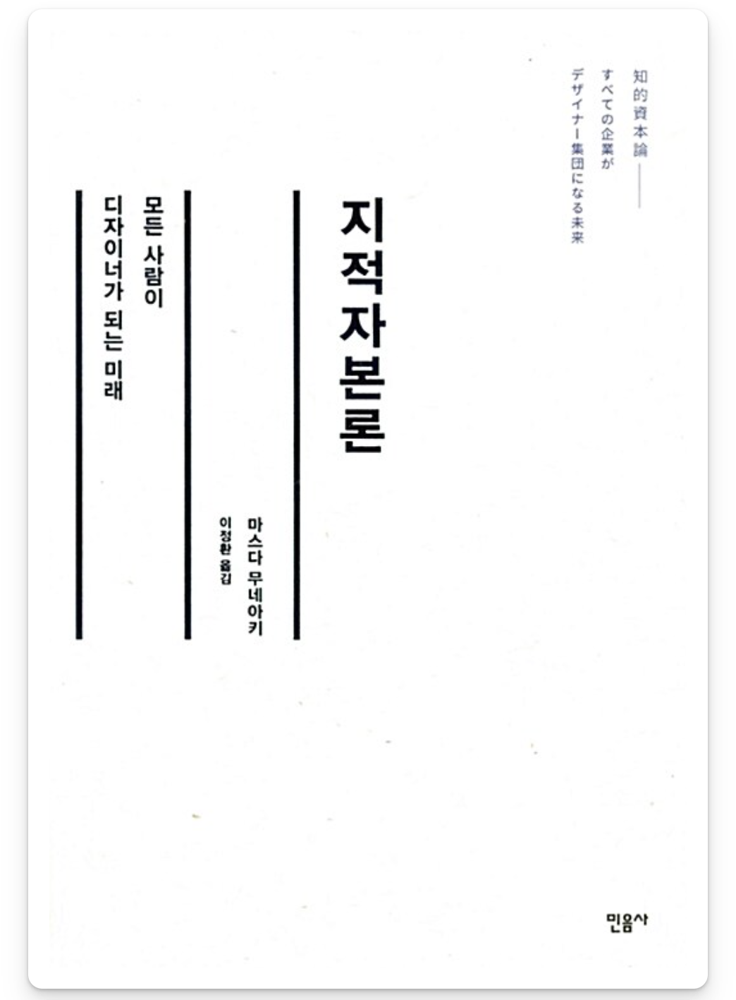

### 3줄 요약
```txt
- '고객 중심' 디자인 능력이 필요한 플랫폼 과잉 시대가 왔다.
- 초개인화 전략은 오프라인에서도 가능하다.
- 산물이 없으면 부산물도 없으니 Just do it.
```

### [서장]
첫 장은 읽는데 시간이 오래 걸렸다. 저자와 다케오 시장의 대화 형식으로 진행된 도입부는 ‘기획’, ‘자유’, ‘개혁’과 같은 추상적인 내용이 대부분이다. 이런 듣기 좋은 단어들을 나열하는건 누구나 할 수 있지 않은가.

### [기]
상품 생산력이 중요했던 시기, 판매 플랫폼이 중요했던 시기를 지나서, 새로운 라이프 스타일을 제안하는 능력이 중요해진 시대 배경을 설명한다. 비교적 구체적이지만 츠타야서점을 처음 듣는 나에겐 여전히 뜬구름 잡는 이야기로 느껴졌다. 하지만 이번 장의 목표가 뒤이어 이야기할 ‘지적자본론’이 왜 중요한지 소개하는 것이라면 나름의 성과는 있었다.

### [승]
플랫폼이 남아도는 시대에 플랫폼을 개혁하는 방법에 대한 구체적인 이야기가 시작됐다. 다른 플랫폼이 온라인에 집중할 때 츠타야서점은 오프라인에 집중했다. 츠타야서점은 가격 경쟁력 대신 서비스 만족도 개선을 선택했다. 기존 판매자 중심의 창고형 서점을 변혁해서 고객의 동선을 고려한 고객 중심의 서점을 만들었다. 츠타야서점에 가본 적이 없지만 어떤 분위기일지 그려진다. 이제는 한국에도 당연해진 고객 중심의 서점 디자인이 어떤 고민에서 시작됐는지 이해할 수 있었다. 다케오 시립 도서관의 사진을 본 것도 아닌데, 다케오로 여행을 가보고 싶어졌다.
(도서관 사진은 책에 마지막에 가서야 나오는데, 결과물이 아닌 메세지의 본질에 집중하길 바라는 의도가 아니었을까 싶다.)

### [전]
이번 장에서는 인터넷 시대에 실물 매장만이 전달할 수 있는 가치를 이야기한다. 인터넷 매장은 고객에게 더 싸고, 더 편리하게 상품을 제공한다. 오프라인 매장은 직접성, 즉시성, 그리고 편안함을 고객에게 제공할 수 있다. 넓은 공간에 진열된 수많은 책을 한눈에 담는 경험은 직접 서점에 가야지 경험할 수 있다. 서점에 가면 그 자리에서 즉시 상품을 받을 수 있다. 섬세한 동선 설계, 그리고 안락한 가구와 인테리어는 온라인에서 느낄 수 없는 편안함을 제공한다.

차별화된 가치를 바탕으로 새로운 라이프 스타일을 전달하려는 저자의 시도는 ‘서점’, ‘도서관’, ‘상업 시설’, ‘가전제품’을 넘어서 ‘데이터베이스 이노베이션’으로 이어진다. 구시대 플랫폼에서는 사업자와 고객 사이에 ‘1→N’ 관계를 형성한다. 저자는 데이터를 활용한 ‘1→1’ 관계의 초개인화된 플랫폼을 제안한다. 다음 장에는 인공지능 이야기가 나올 것만 같았다. IT 업계의 트렌디한 토픽인 WEB3.0과 AI-Native 서비스가 추구하는 방향이 ‘1→1’ 초개인화다. ‘인공지능’이라는 단어가 한번도 나오진 않았지만 자연스럽게 AI가 생각났다. 최근에서야 논의되고 있는 AI-Native 서비스와 저자가 8년 전에 세운 계획이 닮은점이 많아서 흥미로웠다. 나는 주로 초개인화된 디지털 플랫폼만 생각했었는데, 초개인화된 현실 세계 플랫폼은 어떤 형태일지 궁금해졌다.

### [결]
아쉽지만 다행히도 인공지능 이야기는 나오지 않았다. 사실 초개인화가 중요한게 아니다. 결국 가장 중요한건 ‘고객 가치’다. ‘고객 가치’를 극대화하기 위해서 초개인화라는 방법이 제시되었을 뿐이다. 이번 파트에서는 마스다와 CCC가 ‘고객 가치 최대화’에 얼마나 진심인지 느낄 수 있었다. CCC의 상장, 분사, 다시 통합, 비상장, 그리고 다시 분사로 이어지는 말도 안되는 변화의 중심에는 ‘고객 가치 최대화’라는 한 가지 철학이 있다. 회사에 축적된 지적자본과 고객을 접하는 현장 사이의 괴리감을 해결하기 위해 분사를 시도하는 현재의 시도까지 나는 완전히 설득당했다. 내가 다니고 있는 회사는 입사 당시 50명 정도였는데 현재는 120명이 넘는 규모가 되었다. 조직이 거대해지면 세로로 분할되고 역할과 계층이 형성된다는 말이 이해된다. 저자는 마지막으로 신뢰가 가장 중요하다고 강조한다. 정어리 떼와 같이 병렬적으로 움직이기 위해서 ‘자유와 사랑’, ‘약속과 감사’가 중요하다는 접근은 꽤 신선하게 다가왔다.

### [종장]
산물이 없으면 부산물도 없다. 우키요에의 그림들도, 마스다의 경영 철학들도, 모두 예상치 못했던 곳에서 얻은 부산물이었다. 마스다와 다케오시 시장의 추진력이 없었다면 이 책에서 엿본 인사이트도 볼 수 없었다. 기획과 실행 그리고 피드백은 한 번의 사이클로 끝날 수 없고, 병렬적으로 진행해야 가장 큰 임팩트가 나오는 것 같다. 너무 깊게 생각하지 말고 일단 하자.

종장까지 읽고 첫 장을 다시 봤다. 츠타야 서점에 가본적도 없지만, 이제는 마스다와 다케오시 시장의 대화가 이해되고 공감된다. 듣기 좋은 추상적인 단어들이 아니라 깊은 고민과 기민한 실행의 반복에서 얻게 된 부산물이라는 것을 알게 되었다. 플랫폼이 넘쳐나는 이 시대에 나는 어떤 ‘지적자본’을 축적하고 어떤 ‘라이프스타일’을 제안하면 좋을까? 고민만 오래하지 말고 산물을 만들어 보자.

---

### 기억에 남는 문구들

> 밥 딜런 “아침에 잠에서 깨어 자신이 하고 싶은 일을 할 수 있는 사람이 성공한 사람이다.”

> 약속을 하는 것은 간단해. 그러나 그것을 지키기는 어려워. 약속을 지키려면 감사하는 마음이 필요해.

> 좋아하는 사람과 함께 좋아하는 일을 할 수 있는 자유. 그것을 얻으려면 신용이 필요하다.

> 부산물은 무엇인가를 만들어 낸 사람에게만 주어진다. 당연하다. 산물이 없으면 부산물도 없다.

```toc
```
