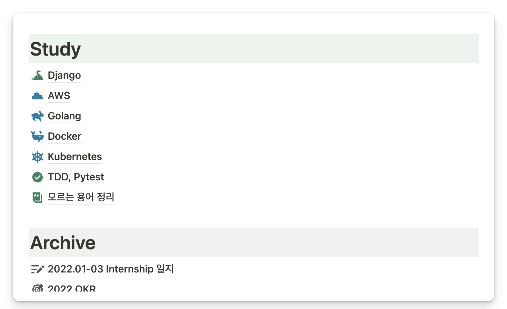
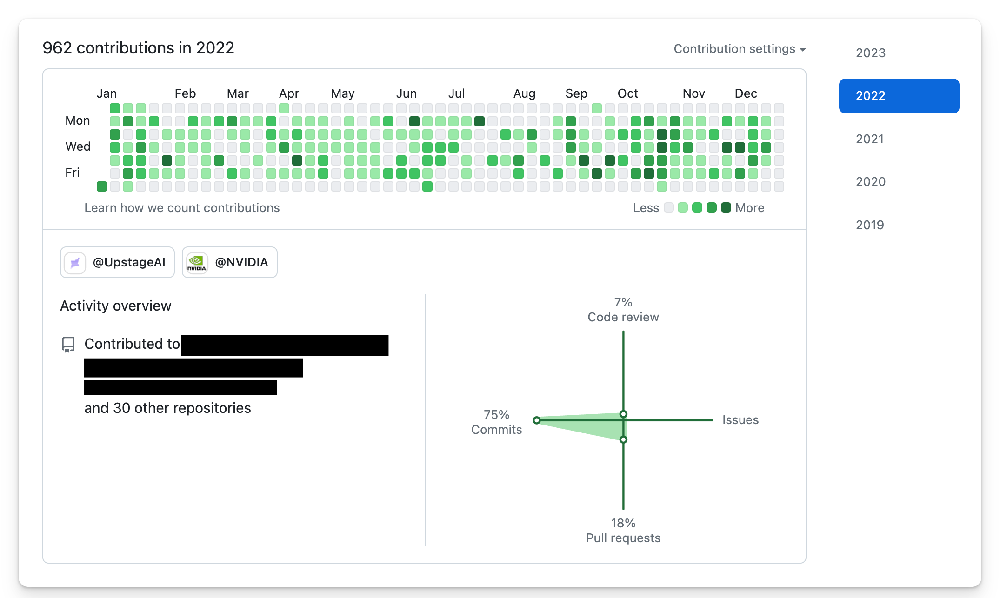

2023년 회고를 쓰려고 했는데, 너무 맥락이 없는 것 같아서 늦었지만 2022년 회고를 먼저 작성한다. 2022년에 기록했던 문서들과 전사회고 때 작성했던 셀프피드백을 바탕으로 기억을 되짚어 작성했다.

## 합격

학부 졸업을 앞두고 감사하게도 정말 가고 싶었던 회사들에 합격했다. 유명 대기업 공채와 시리즈A 단계의 스타트업 전환형인턴 중에 선택할 수 있었다. 성공한 스타트업의 [인터뷰 영상](https://www.youtube.com/@eo_studio)을 보는 것이 취미였던 나는 잠시 미쳤었는지 스타트업에 합류한다.


<br>

여러 가지 이유가 있었지만, 회사가 해결하고자 하는 문제와 해결 방법에 공감한 것이 가장 큰 이유였다.<br>
아쉬움이 없다고 하면 거짓말이겠지만, 어느 쪽을 선택해도 마찬가지였다.<br>
최선의 선택은 한순간 결정되는 것이 아니라 선택 이후에 스스로 만들어가는 것이라 생각한다.<br>

<br>

## Software Engineer [’jabːbu]

AI Platform 팀에서 Software Engineer라 적고 잡부라 읽는 커리어가 시작됐다. 입사 교육 같은거 없이 바로 정글에 투입됐다. 인턴 때는 프론트엔드 개발과 백엔드 api 개발을 주로 했다. 그다음에는 개발뿐만 아니라 (손이 덜덜 떨리는) 배포, GPU 클러스터 운영까지 다양하게 경험했다. 1년 차에 이런 경험들을 하는게 벅찰 때도 있었지만 지금 생각해보면 큰 행운이었다. 나는 확실히 직접 해보면서 배우는 것을 좋아한다.

### 진행했던 프로젝트

- AI Platform GPU 통계 페이지 개발 (Vue.js, Django DRF)
- K8s Continuous Training CRD 개발 (K8s, Golang)
- K8s Spot Instance 기능 개발 (Docker, Golang, Prometheus)
- 기타 등등..

### 하나를 배우면 10개를 모르는..

실무 경험이 전혀 없었기에 처음에는 모르는 용어가 절반 이상이었다. 용어집을 따로 만들어서 익혀야 할 정도였다. 팀에서 사용하는 기술 스택도 대부분 처음이었다. Vue.js, Django DRF, Golang, Kubernetes 등 모르는게 대부분이었다. (오히려좋아)

쿠버네티스가 특히 어려웠다. 온프레미스 쿠버네티스 클러스터에서는 이해할 수 없는 일들이 자주 일어난다. 툭하면 Pod가 죽고, 서버가 고장 난다. 서버 수명이 그렇게 짧고 자주 고장나는 줄 몰랐다. 인프라 전문으로 하시는 분들이 존경스럽다.

2022년 중반에는 자신감이 바닥까지 떨어졌었다. 하나를 배우면 10개의 모르는 개념이 생겼다. 학부 때는 코딩을 나름 잘하는 편이라고 생각했는데, 바깥에 나와보니 나만 못하는 것 같았다.

### 1x 개발자

[10x 개발자](https://www.7pace.com/blog/10x-engineers#:~:text=WTF%20is%20a%20%E2%80%9C10X%20Engineer%E2%80%9D%2C%20Anyway%3F)까지는 아니더라도 하루빨리 1인분은 하고 싶었다.

입사 초반에는 작은 태스크들을 해결하면서 혼자 공부하는데 시간을 많이 썼다. 첫 30일에는 매일 할 일 목록을 기록하고, 질문노트를 만들어서 질문했던 것들을 정리했다.

부끄럽지만 학부 때는 개발할 때 한국어 블로그 위주로만 참고했었다. 한국어 자료도 좋은 내용이 많지만, 돌고돌아 결국 공식문서를 보게 되는 경우가 많았다. 공식문서 먼저 찾는 습관이 생겼다. 스택오버플로우와 미디엄도 더 자주, 더 편하게 볼 수 있게 됐다.

반복해서 헷갈리는 개념들은 개인 스터디 노트를 만들어서 정리했다. 삽질한 것들, 고민한 것들을 다른 팀원도 겪을 것 같다면 문서화하고 공유했다. 확실히 글로 정리하면 그냥 보고 넘어갔을 때보다 더 깊게 흡수할 수 있었다.



### Team

삽질하면서도 많이 배웠지만, 무엇보다 팀원분들의 꼼꼼한 **코드리뷰** 덕분에 빠르게 성장할 수 있었다. 스타트업 특성상 코드리뷰를 못 받는 경우도 많다고 들었는데 감사한 환경이었다. 개발바닥 이동욱님이 [이야기한 것](https://jojoldu.tistory.com/284?category=689637&ref=integer.blog#:~:text=%EB%AC%B4%EC%8A%A8%20%EC%88%98%EB%A5%BC%20%EC%93%B0%EB%8D%94%EB%9D%BC%EB%8F%84-,%EC%BD%94%EB%93%9C%EB%A6%AC%EB%B7%B0%20%ED%95%98%EB%8A%94%20%ED%9A%8C%EC%82%AC%EB%A1%9C%20%EA%B0%80%EC%84%B8%EC%9A%94%20%EA%BC%AD!,-%EC%B2%AB%20Feature%20%EA%B0%9C%EB%B0%9C%EC%9D%B4) 처럼 신입이라면 꼭 코드리뷰 받을 수 있는 회사를 추천한다.

팀원들과 함께했던 **쿠버네티스 스터디**도 도움이 많이 됐다. 금쪽같은 쿠버네티스랑 조금은 친해질 수 있는 계기였다.

신입 개발자들이 으레 그렇듯 나도 어디까지 고민해보고 질문해야 할지 고민될 때가 종종 있었다. 매일 오전 팀원들과 진행 상황을 공유하는 **데일리 스탠드업**이 그런 고민을 줄여줬다. 물론 필요하다면 언제든지 질문할 수 있지만, 데일리 스탠드업을 통해 너무 늦기 전에  한번씩 큐를 비울 수 있어서 좋았다.

2주마다 리더님과 **원온원** 시간도 가졌는데, 항상 나긋한 목소리로 힘든 점은 없는지 물어봐 주신다. 요즘 개발은 재밌는지, 하고 싶은거 있는지 물어봐 주시는 리더님이 계셔서 안정적으로 개발하며 성장할 수 있었다. 나중에 개발조직을 이끌게 된다면 리더님 생각이 많이 날 것 같다.

## 아쉬웠던 점

1인분 하기 바빠서 팀과 회사에 충분히 관심 갖지 못했다. 다른 팀원들은 어떤 문제를 어떻게 해결하고 있는지 살펴보지 못했다. 시야를 넓혀 팀과 회사의 목표를 이해하고, 능동적으로 먼저 나서는 개발자가 되고 싶다.

업무 외적으로 시간 내서 자기개발을 거의 못했다. 사이드 프로젝트도 못했고, 블로그도 못했다. 독서나 운동도 많이 못했던거 같다. 어쩔 수 없었던 것도 있지만, 시간을 더 효율적으로 쓰면 좋겠다.

그리고 1년 회고는 꼭 제때 쓰자 :)

## 2022 잔디 리포트



---
패기롭게 시작했던 2022년은 정신없이 빠르게 지나갔다.<br>
많이 넘어지고 깨졌지만, 덕분에 그만큼 성장도 많이 할 수 있었던 한 해였다.

```toc
```
