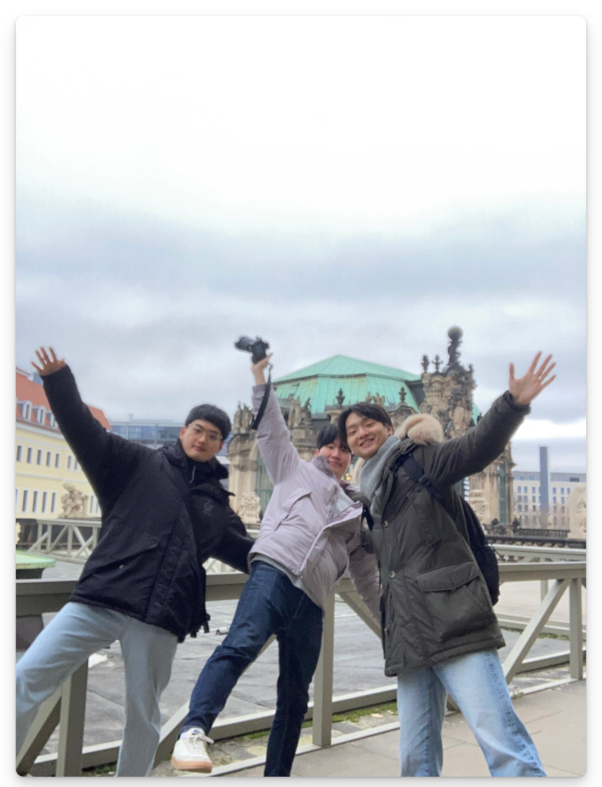
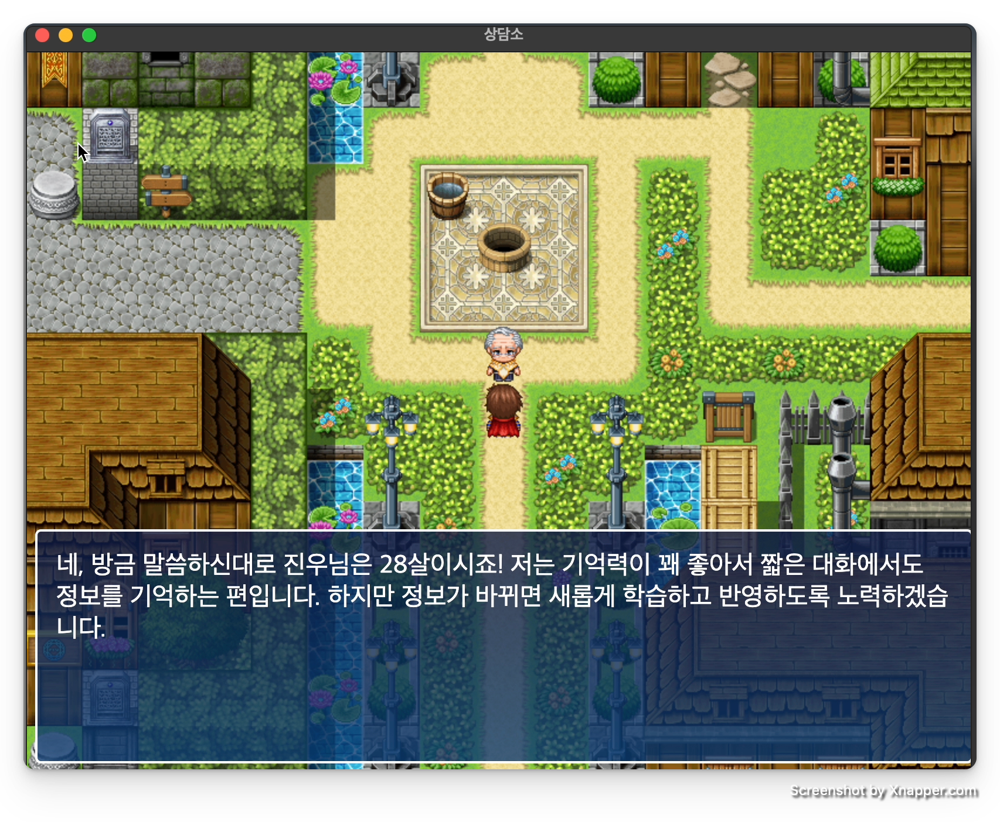
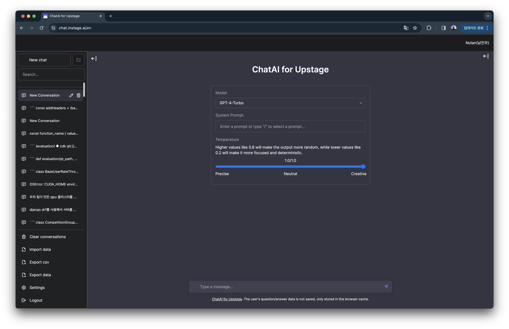
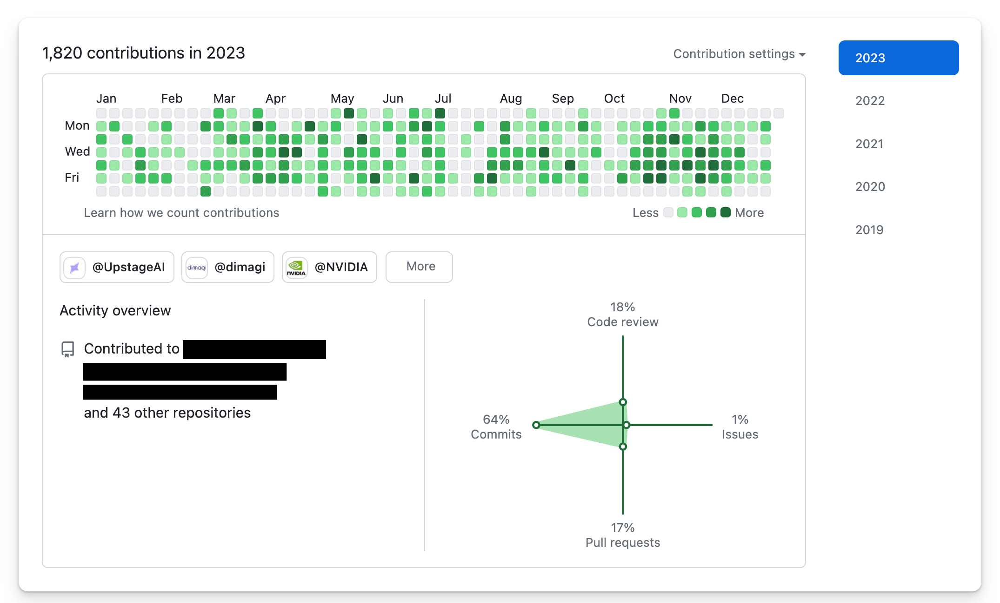

[2022년 회고](https://devnjw.github.io/retrospect/2022/)에 이어 2023년에 경험하고 느낀 것들을 기록해본다. 가능한 시간순으로 정리했다.

<br>

## RBAC 설계 및 개발

올해 가장 재밌었던 개발 중에 하나다. 회사 내부 플랫폼 안에는 다양한 조직과 역할이 있다. 역할에 따라 권한이 달라지는데, 우리 팀에 딱 맞는 Django 라이브러리가 없었다. prbac 이라는 라이브러리가 있지만 모델 레벨의 권한 관리만 가능하고 객체 수준의 권한 관리가 불가능했다. 그래서 직접 만들게 됐다.

Django와 Django DRF의 권한관리 방식을 깊이 이해하기 위해서 내부 코드를 뜯어봐야 했다. [Django Guardian](https://github.com/django-guardian/django-guardian)이나 [prbac](https://github.com/dimagi/django-prbac) 같은 오픈소스 라이브러리도 뜯어봤다. 라이브러리 내부를 들여다보며 파이썬 스타일, 테크닉, DRF 내부 프로세스 등 배우는게 많았다. 추가로 Github의 권한관리 시스템, Kubernetes RBAC 시스템도 참고해서 새로운 Django RBAC 시스템을 설계하고 개발했다.

<br>

## 워케이션

2월에는 유럽으로 한 달 동안 워케이션을 다녀왔다.

친한 대학교 동기 두 명이 독일과 네덜란드에서 유학중이다. 졸업식 때 ‘다음에는 유럽에서 모이자’라고 장난으로 얘기했는데 진짜 유럽에서 모였다. 스위스를 들러 독일, 네덜란드 순으로 이동했다. 휴가도 며칠 썼지만 대부분 일하면서 돌아다녔다.

<br>

친구 집, 스타벅스, 공유오피스, 취리히 공대, 드레스덴 공대 등등 다양한 곳에서 일했다. 취리히 공대에서는 전산학과 건물도 들렀다. 개인적으로 관광지 가는 것보다 현지 사람들 살아가는 모습 보는걸 더 좋아한다. 특히 시장이나 학교를 보면 지나치지 않는다. 세상에는 정말 다양한 사람들이 다양한 모습으로 살아간다. 삶을 바라보는 관점도 다르고 삶을 살아가는 속도도 다 다르다.

꼭 멀리 나가지 않더라도 가끔 이렇게 주변을 돌아보면서 살고 싶다.

<br>

## ChatGPT

모든 사람들이 AI를 사용하는 세상이 내 생각보다 훨씬 빠르게 다가왔다. 그런 세상이 언젠간 올 줄 알았지만 이렇게 빨리, 챗봇의 형태로 시작될줄은 몰랐다. 올해 ChatGPT가 가져온 변화의 물결은 거대했고 지금도 진행중이다.

90년대 후반부터 인터넷 기술이 Web이라는 날개를 달고 빠르게 시장을 변화시켰다. 기존산업이 인터넷으로 확장하기도 하고 완전 새로운 서비스가 나오기도 했다. 나는 AI가 인터넷/Web 같이 산업 전반에 걸쳐 큰 변화를 가져올 것이라는 의견에 동의한다. 기존 서비스에 AI를 더하는 AI-augmented 서비스, 아예 새로운 형태의 서비스를 제공하는 AI-native 서비스 같이 상상조차 하기 어려운 변화가 이미 일어나고 있다.

### 반응형 NPC - 사이드프로젝트

가만히 구경만 하는 성격은 못돼서 뭐라도 만들어보자 다짐했다. 지난 4월, 친구랑 간단한 게임 하나를 만들었다. 게임 개발에는 관심 없지만 가장 먼저 떠오른 아이디어가 반응형 NPC였다. 컨셉은 같이 고민하고, 스토리는 친구가 담당했다. 그래픽 쪽은 친구가, gpt api와 서버 쪽은 내가 담당했다.

‘놀이터에서 처음 만난 7살 어린아이에게도 고민 상담을 받을 수 있지 않을까?’라는 컨셉을 잡고 아이디어를 발전시켰다. 유저가 다양한 페르소나의 NPC들과 어떤 대화든지 자유롭게 나눌 수 있는 게임을 만들고 싶었다. 최종적으로 어린아이, 마을 이장님, 고양이, 닭, 1000살 나무 등의 캐릭터와 대화할 수 있는 게임이 만들어졌다.



둘 다 게임그래픽 개발 경험이 없어서 [RPG Maker](https://en.wikipedia.org/wiki/RPG_Maker)라는 툴을 사용했다. 캐릭터, 배경음악 등 필요한건 거의 다 있어서 쉽게 작업했다. gpt api를 바로 사용하면 대화 내역 기억할 수 없어서 fastapi로 프록시 서버를 만들었다. 배포는 AWS Lightsail을 사용했다. [the-garden-of-worlds.ai](http://the-garden-of-worlds.ai) 라는 도메인도 구매해서 연결했다.

NPC랑 대화하는 경험이 신선했고, 기대한 것 이상으로 몰입감을 느낄 수 있었다. 지인들 위주로 보여주고 반응을 살펴봤다. 닭이랑 대화하는 재미에 빠져서 며칠 동안 대화하는 지인도 있었다. 하지만 대화 컨텐츠만으로는 리텐션을 높이기 어려웠다. 게임 엔딩까지 본 지인들도 있지만, 대부분 초기에 흥미를 잃고 이탈했다.

gpt api 비용은 부담되는 수준이 아니었지만 aws 비용이 한 달에 6~7만원 정도 부과됐다. 서버 비용을 낮추는 방법도 있었지만 이정도에서 만족하고 실험을 종료했다. 다음 사이드프로젝트는 처음부터 서버 비용을 고려해서 설계해야겠다. S3, Lambda를 사용하면 유지비용을 많이 줄일 수 있을 것 같다.

개발은 주로 주말에 했고, 퇴근하고 남는 시간에도 짬짬이 작업했다. 취업 후 첫 사이드프로젝트였는데, 간만에 학생 때 기억도 나고 재밌는 시간이었다.

### 사내용 LLM 채팅 사이트

GPT4가 나오고부터 ChatGPT에 개발 관련 질문을 많이 하기 시작했다. 할루시네이션이 없어진 것은 아니지만, 많이 줄어들었다고 느꼈다. 그런데 매달 2만원이 넘는 구독료는 좀 부담스러웠다. 질문을 아주 많이 하는 것도 아니어서 api를 사용하면 비용 절감이 가능할 것 같았다. ChatGPT 같은 채팅 인터페이스만 있으면 된다.

제법 유용할거 같아서 바로 만들어보기로 했다. 그런데 하루 정도 개발하다가 문득 오픈소스가 있을것 같다는 생각이 들었다. 만들기 귀찮았던거 절대 맞다.. 역시나 잘 만들어진 [오픈소스](https://github.com/mckaywrigley/chatbot-ui)가 이미 있었다.

회사에서 같이 써도 좋을 것 같아서 리더님과 대표님께 말씀드렸다. 흔쾌히 승인해주셨고, 회사에서 api 비용도 지원받을 수 있었다. 구글 로그인을 달아서 회사 내부에 배포했다.



오픈 직후 사내 10% 정도의 직원분들이 매일 사용해주셨다. 그 후 요청이 있어서 Bard, AutoGPT 등의 모델도 추가했다. 프론트엔드 개발자 한 분이 합류하셔서 같이 function call 기능을 이용한 플러그인 인터페이스도 개발했다. 최근에는 회사 자체 LLM Solar도 추가되었고, 사용률이 20%까지 올라왔다. 현재는 LLM Demo 페이지로 역할이 확장되어서 다른 팀에 오너십을 넘겨드렸다.

회사에 도움이 되는 도구를 직접 제안하고 구축해서 좋은 반응까지 얻어서 뿌듯했다.

<br>

## 해커톤 멘토링

7월에는 모교에서 열린 AI 서비스 개발 [해커톤](https://hguhackathon.com/)에 멘토로 참여했다. 처음에는 멘토링을 하기에는 경력이 짧다고 생각해서 망설였다. 하지만 AI 서비스가 주제라면 나눌 수 있는 이야기가 있을 것 같아서 참여했다. 대학생 해커톤 특유의 산뜻한 에너지를 얻어 가고 싶은 마음도 있었다.


해커톤 참가팀들은 푸드, 헬스, 교육 등 다양한 분야의 문제에 접근했다. 재밌는 아이디어가 많았다. 내가 요즘 관심 갖고 있는 미디어 중독 문제를 해결하려는 팀도 있었다. 해결 방법도 기발해서 같이 개발하고 싶다는 생각까지 들었다.

활용하는 AI가 GPT로 쏠리진 않을까 하는 걱정도 있었는데 기우였다. LLM 말고도 OCR, Vision, 추천시스템 등 다양한 모델이 사용되었다. 물론 해커톤 특성상 프로토타입 개발이 목표이고, 주로 api가 사용되기 때문에 웬만하면 모델을 직접 만들진 않는다.

주로 개발 관련된 질문이 많았다. 디버깅 관련 질문은 직접 해봐야 알 수 있어서 답변하지 못한 것도 있었다. 해커톤에서는 개발 완성도도 중요하지만 프로토타입 수준에서 어떻게 더 발전시킬지 계획을 세우는 것도 중요하다. MLOps 경험을 바탕으로 프로덕션 레벨의 서비스를 만들기 위해 고려할 것들을 조언 드릴 수 있었다.

마지막으로 진로 관련된 대화도 나눴다. 학생 때 고민했던 것들을 떠올리며 조언을 드리긴 했지만, 사실 지금도 1년 뒤에 뭘 하고 있을지 상상이 안 된다 하하. 겸손한 마음으로 성실히 살자.

<br>

## 팀 이동

7월 말에는 팀을 이동했다. 사내용 AI 학습 플랫폼을 만드는 팀에서 외부용 경진대회 플랫폼을 만드는 팀으로 이동했다. 외부 사용자들을 만날 수 있어서 기대됐다. 12월까지 레거시 코드를 걷어내고 유지보수하기 좋게 리팩토링하는 작업이 팀의 주요 목표였다.

### AWS CDK, CodePipeline

팀 이동 후 가장 먼저 했던 것은 개발 환경을 개선하는 작업이다. 초기에 개발 환경을 잘 구축해둬야 운영에 힘을 덜 들이고, 더 중요한 작업에 집중할 수 있다.

초기 설계부터 주도적으로 참여하며 많이 배울 수 있는 경험이었다. 바쁜 일정이었지만 리더님과 계속 리뷰 주고받으며 코드 퀄리티는 타협하지 않으려고 노력했다.

인프라 관리를 위해 AWS CDK를 도입했다. 다른 IaC 툴도 많지만, 회사에 아마존에서 오신 시니어 개발자분들이 있어서 자연스럽게 CDK를 사용했다. 실제로 도움을 많이 받았다. 자원을 하나씩 이동해서 지금은 모든 AWS 자원을 코드로 관리하고 있다.

AWS CodePipeline을 이용해서 배포 자동화 환경도 구축했다. Github Actions도 사용했는데, 코드 테스트와 스타일 체크 정도에 활용한다. 기회가 되면 우리 팀의 배포 시스템에 대해 따로 자세히 정리해보면 좋을 것 같다.

### 레거시 코드 리팩토링

경진대회 플랫폼은 회사에서 가장 오래전에 만들어진 제품이다. 지금까지는 이 플랫폼을 전담하는 팀이 없었는데 유지보수가 점점 어려워져서 이번에 전담팀이 만들어졌다.

세월의 흔적과 그동안의 긴박함이 느껴지는 코드였다. 하나의 함수나 클래스가 너무 많은 역할을 담당하고 있었고 의존관계가 엉켜있었다. 작은 기능 하나를 수정하려고 해도 신경 써야 하는 부분이 너무 많았다.

DRF스럽게 api를 추상화하고 view에 몰려 있던 서비스 로직을 적절히 serializer, model로 분산했다. ‘Fat models, skinny views' 스타일로 변경했다. 10초가 넘게 걸리는 api도 있었는데, join 순서를 변경해서 1초 이하로 줄이는 작업도 진행했다. 어드민 페이지 기능을 강화해서 운영 부담을 줄였다.

프론트 단에서는 먼저 불필요한 기능들을 쳐내고 최소한의 기능만 남겼다. 재사용할 함수들을 따로 분리하고, 함수 하나가 너무 많은 역할을 하지 않도록 분리했다. api 호출 시점을 늦춰서 로딩 시간과 서버 부하도 개선했다.

클린한 코드의 중요성을 몸소 깨달을 수 있는 경험이었다. 아직 개선할 부분도 많이 남아 있다. 리팩토링에 끝은 없는 것 같다. 시간이 지나면 엔트로피가 증가하고, 내 방이 더러워지는 것처럼, 모든 코드는 주기적으로 리팩토링이 필요한 것 같다.

<br>

## 블로그

12월에는 블로그를 다시 시작했다.

지난 2년 동안 배운 것도 많지만 휘발되는 것도 많았다. 그리고 요즘 숏폼 컨텐츠를 많이 소비하면서 점점 정보처리능력이 떨어진다고 느낀다. 따로 시간을 내서 읽고 쓰는 노력을 하지 않으면 바보가 될 것만 같다. 앞으로 새롭게 배운 것들이나 서평 같은 것들을 종종 적어보려고 한다.

새로운 마음으로 블로그도 새로 만들었다. 블로그를 다시 시작한 더 자세한 이유는 [첫 번째 글](https://devnjw.github.io/why-i-started-blog-again/)에 적어뒀다.

<br>

## 커리어 고민

### 둥글둥글한 개발자

취업한 게 엊그제 같은데 벌써 2년이라는 시간이 지났다. 감사하게도 짧은 시간 동안 다양한 경험을 했다. 개발자라는 1차 전직은 무사히 시작한 것 같다. 요즘은 다음 스텝을 어떻게 해야할지 고민 중이다. 계속해서 풀스택으로 두루두루 역량을 쌓아갈지, 아니면 백엔드나 MLOps로 방향을 정하고 뾰족한 역량을 키워야 할지 고민된다.

취업 전에도 그랬고 지금도 그렇고 나는 엔드유저랑 가깝게 일하는게 재밌는 것 같다. 그렇지만 AI가 얼마나 강력한 도구인지 알기 때문에 AI와도 가깝게 지내고 싶다. 계속 둘 다 가깝게 지낼 수 있을까

### 1인 개발자

최근에는 1인 개발자의 시대가 시작됐다는 생각을 많이 한다. 개발은 점점 쉬워지고 있고 클라우드 서비스도 계속 발전하고 있다. 개발자가 기획 능력을 갖춘다면 혼자서도 좋은 프로덕트를 만들고 유지보수 할 수 있을 것 같다. 실제로 그런 [사례](https://maily.so/josh)들이 많이 나오고 있다.

1인 개발자가 아니더라도 기획 능력(문제 정의 능력, 주인 의식)은 중요한 것 같다. 시장이 점점 더 빠르게 변화하고 있다. 변화에 뒤쳐지지 않으려면 더 많은 조직원이 능동적으로 사고해야 하지 않을까.

<br>

## 2023 잔디 리포트



<br>

## 2024 목표 (1월 중 업데이트 예정)
- 


```toc
```
