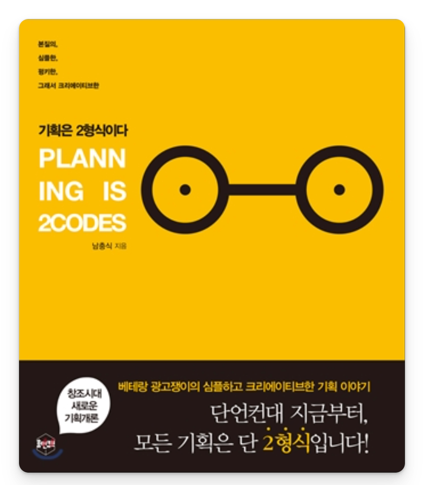
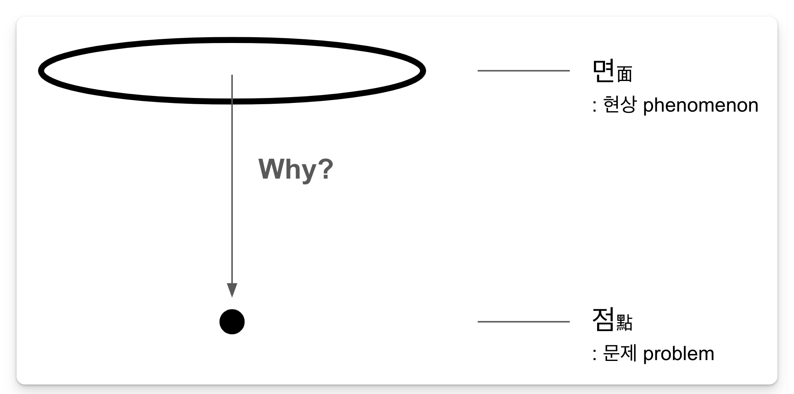

### 세 줄 요약
```txt
- 기획의 본질은 문제를 해결하는 것이다.
- 현상이 아니라 본질에 접근해야 한다.
- 본질에 접근하려면 상식에 도전하는 질문이 필요하다.
```

### 질문하는 능력
카이스트 석사과정을 밟고 있는 친구에게 대학원에서는 어떤걸 배우는지 물어본 적이 있다. 친구는 잠시 고민하더니 “특별히 뭘 배우는거 같진 않아. 그런데 질문 하나는 더 잘하게 된거 같아.”라고 대답했다. 2년 내내 질문하는 방법을 훈련한다니.. 살면서 처음으로 대학원생이 부러웠다. 나도 좋은 질문을 하고 싶다.

대학원에 질문하기 강의가 따로 있는 것은 아니다. 스스로 문제를 정의해야 하는 환경이기 때문에 자연스레 질문하는 능력이 생긴다. 좋은 연구는 좋은 질문에서 나온다. 질문을 가장 잘하는 사람 중 한명이 일론 머스크다. 제 1원칙 사고법을 하는 것으로 알려진 일론 머스크는 물리적 차원까지 깊이 내려가서 의문을 제기한다.

> I think it's also important to reason from first principles rather than by analogy. …<br>
> First principles is kind of a physics way of looking at the world and what that really means is you kind of boil things down to the most fundamental truths and say ‘okay what do we sure is true or sure as possible is true?’ and reason up from there.

대부분의 사람들은 지금까지 배터리팩이 비쌌기 때문에 앞으로도 비쌀 것이라고 유추한다. 하지만 일론 머스크는 상식이 사실인지 질문했고, 전기차 대량생산에 성공했다.
러시아에서 중고 로켓을 구매하려던 일론은 가격이 터무니 없이 비싸서 직접 만들기로 한다. 우주선 가격이 합당한지 질문했고, 70퍼센트의 로켓 구성품을 자체 제작하게 된다. 이제는 우주선을 재활용하기까지 이른다.

### 문제의 현상과 본질
‘기획은 2형식이다’에서도 같은 이야기를 한다. Why?라고 되물으며 문제의 본질에 집요하게 파고들어야 한다고 이야기한다. 저자는 8시간이 주어진다면 6시간을 문제 정의에 쓰라고 조언한다. 이때, 문제의 현상(Phenomenon)과 문제의 본질(Problem)을 구분해야 한다.



‘토끼와 거북이’ 우화에서 토끼는 왜 거북이에게 졌을까? 낮잠을 자서? 낮잠을 잔 것은 현상이다. 문제의 본질은 토끼가 자만했다는 것이다. (살짝 핀트를 벗어나서, 나는 토끼와 거북이가 달리기로 경쟁한 것도 문제라고 생각한다. 철인 3종 경기를 했으면 모를까)

### 기획 3.0의 시대
많은 일자리가 AI로 대체되고 있으며 그 속도는 점점 더 빨라지고 있다. 안전할 줄 알았던 예술직종 일자리도 생성형AI가 부상하며 대체 1순위 타겟이 되었다. 시키는 일만 하는 사람은 대체되는 시대가 왔다. 스스로 질문하고 스스로 문제를 정의하는 사람만 살아남을 것이다. 질문하는 자만 살아남는다. 기획자만 살아남을 것이다. 모든 조직원이 기획자가 되어야 하는 기획 대중화 시대. 기획 3.0의 시대가 왔다.

---

### 기억에 남는 문구들

> “현상은 복잡하고 본질은 단순하다” - 아리스토텔레스

> 기획 1.0 시대 : 기획이 별로 중요하지 않았던 시대. 창업주의 직관에 의존했던 시대<br>
> 기획 2.0 시대: 기획 업무는 주로 컨트롤 타워 역할의 기획실이 수행했던 시대<br>
> 기획 3.0 시대: 모든 조직원이 기획자가 되어야 하는 기획 대중화 시대

> 기획자가 ‘해결해야 하는 문제’는 현상적인 면面이 아니라 원인적인 점點입니다.

> 기획은 마음가짐입니다. 그것은 곧 ‘목적의식’이요, ‘주인의식’입니다. 기획력은 능력이 아니라 태도입니다.

> 기획의 솔루션은 대단한 것이 아닙니다. 살짝 낯설고 공감되는 생각일 뿐입니다.<br>
> 발상하지 마세요. Problem에서 연상하세요.<br>
> ’되도록 멀리서’, ‘되도록 보이지 않는 것들을’, ‘되도록 많이’ 훔치세요.<br>
> 훔친 티 안 나게 뒤섞으세요. 그리고 하나의 아이디어로 표현해보세요.

> 세상에서 가장 쉬운 프레젠테이션 비법을 알려드리겠습니다. 오디언스를 친구로 만드세요.

> TED의 앤더슨 씨는 오디언스를 지난 1년간 보지 못한 친구라고 생각하며 눈을 맞추라고 조언합니다.

```toc
```
