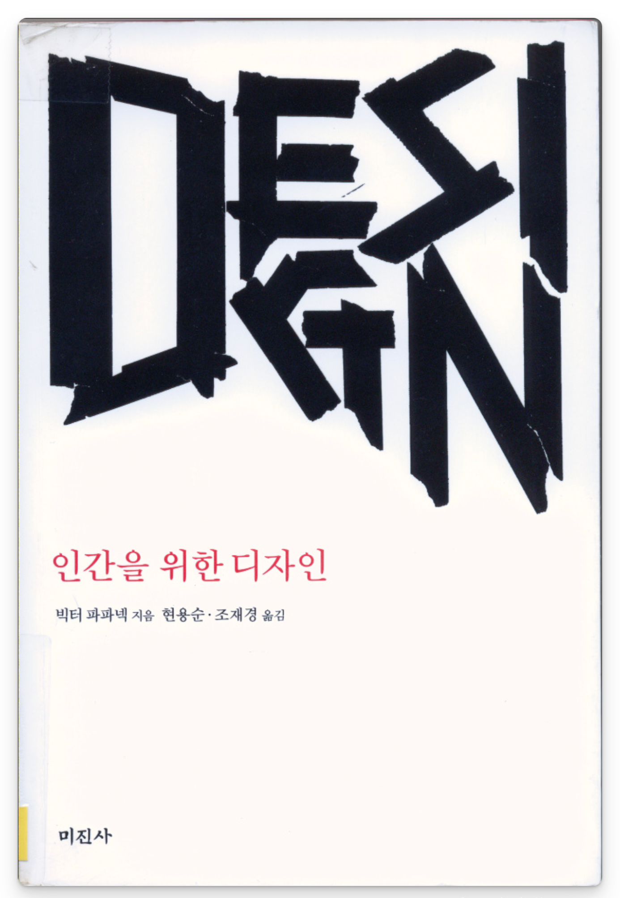
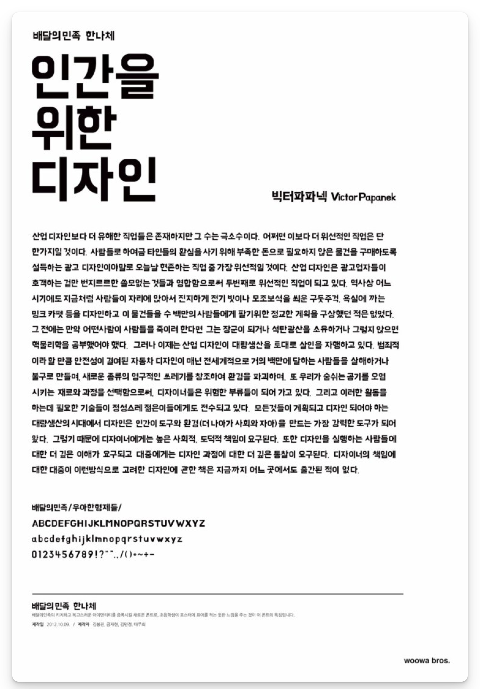

### 세 줄 요약
```txt
- 좋은 디자인은 질서를 만들고 생명을 살린다.
- 잘못된 디자인은 사람을 죽이고 환경을 파괴하며 사회를 병들게한다.
- 우리 삶의 10분의 1을 사회를 위해 사용할 것을 제안한다.
```

### 느낀 점

‘인간을 위한 디자인’은 복잡하고 지루했다. 도대체 무슨 말을 하고 싶은 건지 모르겠는 장도 있었다. 어려운 표현과 예시 끝에 가보면 뻔한 사회 문제들을 다루고 있다. 하지만 이 책이 1960년대에 쓰였다는 것을 고려하고 보면 이해가 되는 것을 넘어 내가 부끄러워진다.

1960년대에 2024년에도 공감할 수 있는 사회 문제를 정의하고 해결 방법을 제안하는 작업은 복잡한 게 당연할지도 모른다. 영화 신세계를 본 후에 디파티드나 무간도를 보면 지루할 수 있듯이, 저자가 지적하고 예상한 사회 문제들을 직접 겪으며 살아온 나에게 책이 지루했던 것도 어느 정도 이해가 된다.

노동자의 안전, 제3세계의 문제들, 환경 문제 등 저자가 언급하는 사회적 문제와 디자이너의 책임은 책의 출간 당시에는 크게 공감 받지 못했다. 오히려 비판하고 비난하는 사람들이 많았다. 하지만 지금은 초등학생들도 알고 있을 사회 문제들이다. 기업의 이윤 극대화를 위한 안전하지 않고 환경 파괴적인 디자인은 너무 많은 사회 문제를 가져왔다. 그중에는 이미 해결된 것도 있지만, 복구 불가능한 수준이 되어서야 관심을 받기 시작한 문제들도 있다.

자본주의 구조 안에서 저자와 같이 사회문제에 뛰어들어 디자인하고 후대를 양성할 수 있는 책임감을 가진 사람은 많지 않을 것이다. 저자는 그 대안으로 우리 시간의 10분의 1을 사회 문제 해결을 위해 사용할 것을 제안한다.

책임감만 있어서는 문제를 해결할 수 없다. 문제를 해결하기 위해서는 문제를 인식하는 것에서 시작해서 잘 정의하고 창조적인 해결 방법을 디자인 해야 한다. 창조적 혁신을 위해서 새로운 실험과 실패가 필수적이다. 하지만 불행하게도, 책임감과 실패가 용인되는 분위기, 이 둘이 다 갖추어지는 경우는 드물다. 

빅터 파파넥이 제시하는 문제와 제안하는 해결 방식에 깊이 공감하면서도, 현실을 살아가기 바쁘다는 핑계로 나는 문제를 외면하고 부끄럽게 살아간다.

---

### 기억에 남는 문구들

> 디자인은 의미 있는 질서를 만들어 내려는 의식적이고 직관적인 노력이다. p.27

> 디자이너들은 종종 기본적인 기능상의 필요를 초월하려는 시도를 한다. 정확성이나 간결성 같은 더 압축된 표현 방식을 갈구하는 것이다. … 사물의 단순성에서 유추되는 특수한 만족감은 간결함이라 불릴 수 있을 것이다. p.53

> 디자인의 궁극적 의무는 인간의 환경과 도구를 변형하고, 더 나아가 인간 자신까지도 바꾸어 내는 것이다. p.57

> 가구, 자동차, 옷 그리고 가전제품을 이렇게 쓰고 (고장 나기 전에 유행에 맞춰) 버리는 것은 곧 우리로 하여금 결혼관계(그리고 인간관계들)도 마음에 들지 않으면 버리는 것으로 여기게 한다. p.125

> 빵은 충분하되 이상이 결핍된 곳에서 빵은 이상의 대체물이 될 수 없다. 그러나 빵이 부족한 곳에서 이상은 곧 빵이다. p.145 - 조숙한 자서전



배달의 민족 포스터에도 사용되었던 책의 문구

```toc
```
