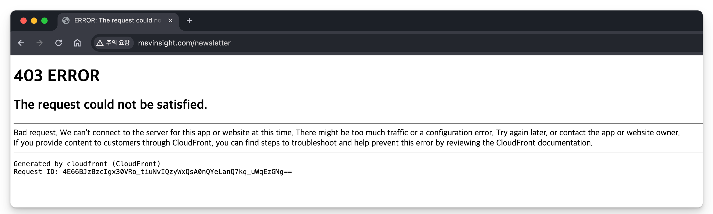

최근에 읽은 책 ‘인간을 위한 디자인’의 저자는 우리 삶의 10분의 1을 사회를 위해 사용할 것을 제안한다. 구체적으로 내가 무엇을 할 수 있을까 궁금했다. 친구가 ‘오렌지레터’와 ‘루트임팩트레터’를 추천해줬다. 구독하자마자 기다렸다는 듯이 “차별 없는 접근성을 향한 관심을 일로 만드는 법”이라는 강연이 올라와서 바로 신청했다.

발달 장애인들을 위한 쉬운 정보를 편집하는 신수연 PM님, 장애인들을 위한 제품을 디자인하고 제안하는 미션잇의 김병수 대표님 이야기를 듣고 왔다. 글을 적거나 발표할 때, 초등학생도 이해할 수 있을 정도로 쉽게 설명하라고 많이들 얘기한다. 강연에서 만난 연사분들은 그것보다 더 눈높이를 낮추려고 노력하시는 분들이다.

## 소소한 소통 신수연 PM

신수연님이 소소한소통 지원을 결심하게 만들었던 채용공고. 

```
나의 일이 누군가의 삶에 있어서 중요한 의미가 되길 원하시는 분,
사회의 아름다운 변화를 위해 나의 재능을 기여하고 싶은 분
```

신수연님은 발달 장애인들을 위한 쉬운 책을 만드신다. 비장애인에게는 당연할 수도 있는 ‘건강’, ‘연애’, ‘투표’, ‘운동’과 같은 것들을 소재로 한다. 이해하기 쉬운 이미지, 글, 수어, 점자 등의 다양한 형태를 활용해서 정보를 제공한다.

쉬운 정보를 만들려면 본질적인 질문에서 시작해야 한다. 발달 장애인을 위한 쉬운 비만 관리책을 쓰실 때는 ‘지방이란 무엇인가?’, ‘살을 왜 빼야 하는가?’ 같은 질문부터 답해야 했다고 하셨다. 일반인들도 이해하기 어려운 의사들의 언어를 발달 장애인들이 이해할 수 있게 편집해야 한다. 얼마나 깊은 고민과 물음이 필요할지 상상이 안 된다.

어떤 표현이 쉬운 표현일지 반복해서 점검하고 검수한다고 하셨다. 여러 가지 체크리스트도 만들어가며 쉬운 표현을 고민한다. 표현만 쉬우면 되는 것이 아니라 의미도 있어야 한다. 소소한 소통에서 책을 쓸 때는 항상 다음과 같은 질문을 한다.

```
- 당사자의 삶에 공감하고 있는가?
- 당사자의 목소리를 담고 있는가?
- 당사자가 스스로의 삶을 결정할 수 있도록 지원하는가?
```

이 질문들은 발달장애인을 위한 책뿐만 아니라 어떤 제품을 만들더라도 적용할 수 있을 것 같다. 소소한소통 면접에서도 면접자가 발달장애인을 대하는 태도뿐만 아니라 사람 자체를 대하는 태도를 본다고 하셨다. 역시 본질적인 것이 중요하다.

QnA 시간에 ‘지금의 커리어가 만족스러우신가요?’라는 질문이 있었다. 신수연님은 “다른 평범한 편집자의 커리어를 살았을 때보다, 소소한소통에서 커리어를 쌓고 죽었을 때의 모습이 조금 더 만족스러울 것 같다”라고 답하셨다.

나는 과연 죽을 때 만족스러울 길을 가고 있는가? 내가 하는 일의 결과물이 더 나은 세상을 만드는 데 기여하고 있는지 되돌아본다. 나의 일이 누군가의 삶에 중요한 의미가 된다면 얼마나 뿌듯할까.

## 미션잇 김병수 대표님

> 사회적 변화는 Design(물리적 변화), Contents(인식의 변화) 두 가지에서 일어난다.
> 

미션잇은 소외계층의 사용자 경험을 개선하고 사회혁신 인사이트를 발굴하는 디자인, 컨텐츠 회사다. 

미션잇의 주요 수입원은 B2B 디자인 컨설팅과 MVS라는 컨텐츠다. 인터뷰, 관찰조사 통해서 “포용적 사용자 경험 인사이트” 발굴한다. 대표님은 관찰하고 분석하는 능력, 그리고 글 쓰는 능력이 중요하다고 강조하셨다.

> 전문성과 대중성 둘 다 중요하다.
> 

유니버셜 디자인에 대한 연구와 논문은 꽤 많이 나오지만, 대중에게 잘 전달되지 않는다. 반대로 너무 대중적이기만 한 디자인은 지속 가능하지 않은 경우가 많다. 전문성과 대중성을 모두 갖춘 디자인이 필요하다고 하셨다.

> 접근성 디자인은 단순히 접근을 허가하는 수준이 아니라 누군가의 삶을 생동감 있게 만들어주는 긍정적인 행위가 되는 것입니다.
> 

장애인 맞춤형 디자인이 왜 필요할까? 그냥 주변인의 도움을 받으면 되는 것 아니냐고 생각하는 사람들도 있다고 한다. 자유의지 실현을 위해 맞춤형 디자인이 필요하다. 일하고 싶고, 참여하고 싶고, 원하는 대로 선택하고 싶고. 누구나 자유의지를 갖고 행동하고 싶은 욕구가 있다. 김병수 대표님은 “가능한 많은 사용자에게 선택할 수 있는 자유와 스스로 할 수 있는 즐거움을 주는 것이 디자이너의 역할”이라고 말씀하셨다.

내 인생에서 가장 불행했던 순간을 떠올려 보면 자유의지를 상실한 논산훈련소에 있을 때가 떠오른다. 자유의지는 인간에게 주어진 가장 큰 선물이고 권리라고 생각한다. 장애인들을 위한 디자인의 가치를 자유의지로 연결 지어서 설명해주셔서 가슴에 확 와닿았다.

> 내가 가진 재능을 나를 위해서만 쌓아가는 인생이 되고 싶지 않았어요.
> 

> ‘네 이웃을 네 몸과 같이 사랑해라.’ - 마태복음 22장 39절
> 

삼성전자에서 디자이너로 일하시던 김병수 대표님은 “Design for 90%” 라는 책을 읽고 디자인에 대한 관점이 바뀌었다. 의사만 사람을 살리는 것이 아니라 디자이너도 사람을 살릴 수 있다는 큰 깨달음을 얻게 되었다고 한다.

그 후 방글라데시 단기 선교를 다녀와서 남들이 잘 가지 않지만, 가치 있는 좁은 길을 가기로 결정하셨다.

듣기만 해도 너무 멋있고 가슴이 뛰는 이야기다. 듣기만 해서 그런 걸 수도 있다. 나는 그런 결정을 할 용기가 없다.. 때마침 내 눈에 들어온 질문.

> 편하게 살고 싶어요. …
> 

문제의식은 가지고 있고, 문제에 공감하지만 편하게 살고 싶은 마음이 훨씬 크다는 질문이었다.

대표님은 본인은 어렵게 시작했고, 어렵게 사업을 이어가고 있지만, 더 현명한 방법도 있을 거라고 하셨다. 소셜벤처라고 꼭 돈 못 벌고 굶어야 하는 건 아니라고. 어떻게 하면 더 안정적으로 할 수 있을지 고민해야 한다고 조언해주셨다.

## 후기

평범한 편집자였던 신수연님을 사회적 기업으로 이끈 것은 ‘부채감’이었다고 했다. 내 삶의 여러 동력 중 하나도 ‘부채감’이다. 내가 우연히 갖게 된 것들을 당연히 여기지 않으려고 노력한다. 가진 것들을 내려놓을 용기까지는 없지만, 우연히 갖게 된 것들을 열심히 불려서 나누고 싶은 마음이다. 강연을 듣고 삶이 180도 바뀐 것은 아니지만 내일을 더 열심히 살아갈 에너지(부채감)를 얻어 간다.

의사만 사람을 살리는 것이 아니고, 디자이너만 사람을 살리는 것도 아니고, 개발자도 사람을 살릴 수 있다. 내가 지금 열심히 익히는 내 전문성이 소외된 90%를 위해 쓰일 수도 있다. 나의 일이 누군가의 삶에 중요한 의미가 되고, 누군가의 삶을 더 생동감 있게 만드는 것은 상상만 해도 설레는 일이다. 상상만 하진 말자.

상상을 현실로 이어가기 위한 다음 스텝으로 MSV에서 만든 책 ‘이동’과 ‘직업’ 두 편을 구매했다. 읽어보고 느끼는 바가 많으면 서평도 남겨볼 예정이다. MSV 뉴스레터도 구독하려고 했는데, 홈페이지에서 403 Error가 나온다. 개발자가 전문성을 발휘할 수 있는 작은 문제를 하나 발견했다.



```toc
```
