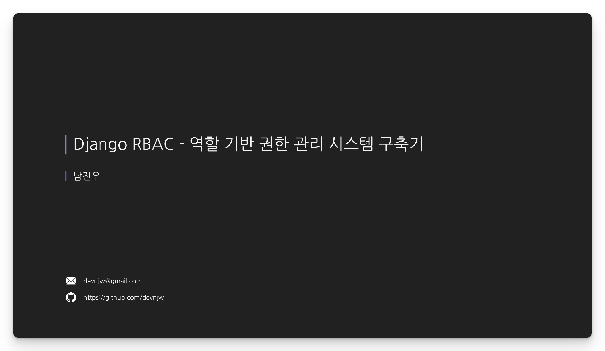
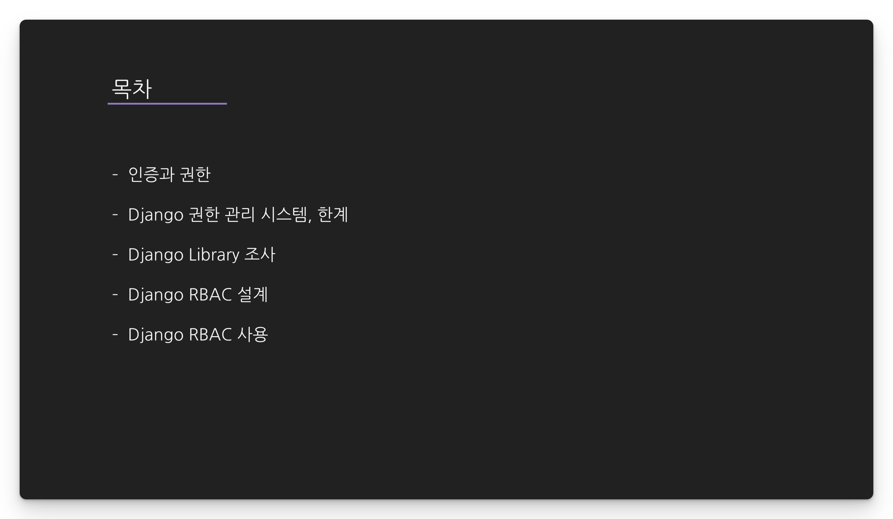

[PyWeb Symposium 2024](https://pyweb.python.or.kr/)에 발표자로 참석했다. 유익한 시간이었다. 내 발표를 준비하면서도 많이 배우고, 다른 분들의 발표를 보면서도 배울 점이 많았다. 행사 마지막에 마련된 패널 토크도 재밌었다.

## 내 발표 - Django RBAC

### 계기

기회가 된다면 외부 개발자들 앞에서 발표를 해보고 싶다는 생각은 예전부터 있었다. 그러다 PyWeb Symposium 2024 발표자 모집 글을 보게 되었다. 주니어들의 지원을 적극 권장하는 홍보 글을 보고 바로 지원했다.

### 발표 내용

[2023 회고 글](https://devnjw.github.io/retrospect/2023/)에서 언급한 **Django RBAC 설계 및 개발**에 관해 발표했다. 발표자 지원서에 다음과 같이 발표 소개 글을 작성했다.

> 플랫폼을 운영하다보면 자연스럽게 다양한 조직과 다양한 자원이 만들어집니다. 조직과 자원 사이의 복잡한 권한 관계를 다루는 것은 매우 중요한 일입니다. Kubernetes나 Github 등의 대규모 시스템에서는 역할 기반 권한 관리 체계(RBAC)를 통해 복잡한 권한 관리 문제를 해결합니다.
>
> RBAC 시스템을 Django에서 구현하려면 어떻게 해야될까요? Django Permission을 활용하면서, 기존 라이브러리들의 한계를 보완한 Django RBAC 시스템 구축 경험을 공유합니다.



1년 차 주니어 개발자도 이해할 수 있기를 바라는 마음으로 준비했다. 회사에서 팀원들에게 공유할 때와는 달랐다. 간단한 용어 설명부터 시작해서 Django 권한 관리 체계를 설명하고, 어떤 상황에서 Role-based Access Control 시스템이 필요한지 설명했다.

이해하고 있다고 생각했던 개념도 쉽게 설명하려고 보면 어려웠다. 내가 잘 이해하고 있는게 아니었다. 추상적이었던 머릿속 개념들이 조금 더 뚜렷해졌다. 앞으로는 팀원들에게 공유할 때도 이렇게 쉽게 설명하려고 노력해야겠다. (시간이 허락하는 선에서..)

### 발표 분위기

한국 Microsoft 오피스에서 발표했는데, 전망도 좋고 날씨도 정말 좋았다.


긴장을 아예 안 한 건 아니지만 설레고 즐거운 마음이 더 컸다. 발표는 열 분 정도가 들어주셨다. 행사는 100명 정도 규모였는데, 옆 방 발표 ‘FastAPI를 활용한 MSA 설계’로 많이 몰렸던 것 같다. 다음에는 더 재밌는 주제로 발표해봐야겠다. 그래도 열 분이라도 와주셔서 감사했다. 끝나고 한 분께 어쩌다 이 주제를 들으러 오셨는지 여쭤봤는데 처음 들어보는 개념이라서 궁금했다고 얘기해주셨다. 혹시 발표에서 아쉬운 점은 없었는지도 여쭤봤는데, 권한 관리해 본 적이 없었지만 모두 잘 이해되었다고 해주셨다. 감사하다.

## 다른 발표

FastAPI 내부 구조, FastAPI 비동기처리, Serverless, HTMX 등 흥미로운 주제가 많았는데, 그중에서 최승일님이 발표하신 ‘캐시 패턴의 진화사’ 발표가 가장 기억에 남는다.

Django를 사용해서 2000만 유저를 대상으로 알림 보냈던 경험기를 공유해주셨다. 어떤 레이어에 캐시를 작성하는 것이 효율적이라고 생각했는지, 트래픽이 증가함에 따라 어떤 문제가 발생했고 어떤 패턴으로 문제를 해결했는지 배울 수 있었다.

승일님의 발표를 포함해서 좋았다고 느낀 발표들에는 스토리가 있었다. 흥미로운 소재 → 문제 상황 → 해결 → 더 큰 문제 → 다시 해결. 공감 가는 소재와 문제는 듣는 이가 집중하게 했고, 고민 과정과 해결 방법으로 전개되는 이야기는 관객을 설득했다.

발표를 준비하면서 최대한 이해하기 쉽게 구성하려고 노력하긴 했는데, 전체 스토리를 고민하지는 않았다. 발표는 듣는 이를 나에게 몰입하게 하고, 설득하는 행위라는 생각이 들었다. 그러려면 청중을 계속 납득시켜야 한다. 다음에는 스토리를 만든다는 마음으로 발표를 준비하면 더 좋은 발표가 될 것 같다.

## 패널 토크

행사 마지막에는 “파이썬 웹 개발자의 과거/현재/미래”라는 주제로 패널 토크가 있었다. 2000년대 후반부터 파이썬을 사용하신 시니어들을 사회자가 인터뷰하는 방식으로 진행됐다. Python 웹 개발자의 시장성을 우려하는 질문들이 많았다. 나도 가지고 있던 생각이라서 공감하면서 들었다. 그리고 사회자분이 너무 웃겨서 재밌었다.

한 패널분이 Python의 짧은 호흡이 본인과 잘 맞는다고 하신 것도 고개를 끄덕이게 했다. 커리어 초반에는 C,C++, 임베디드 개발했었는데 파이썬을 접하고 이게 내 언어라고 생각하셨다고 한다.

내 생각보다 Django가 더 좋은 프레임워크일 수도 있겠다는 생각도 가지게 되었다. Django의 생산성을 칭찬하는 이야기가 많았다. 물론 동시에 한가지 언어와 프레임워크에 종속되지 말자는 생각도 했다.

파이썬 웹 개발 생태계가 다른 생태계 (node, spring)에 뒤처지는 이유는 뭘지, Python 커뮤니티가 어떻게 하면 더 커질 수 있을지 이야기도 나눴다.

좋은 경험이었다. 발표자가 아니더라도 앞으로 종종 이런 세미나에 참여해야겠다.

```toc

```
